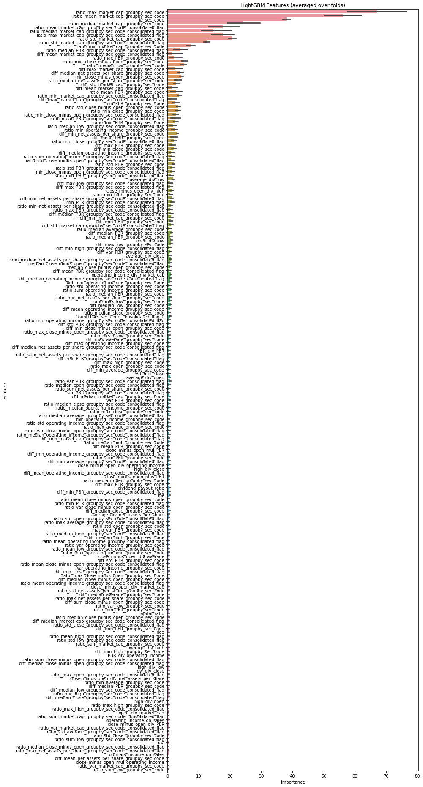
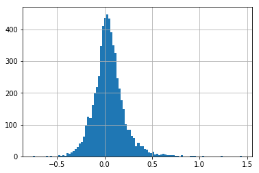

# Approach

The 2nd place approach can be summarized as follows:

1. Create 1180 features only from financial information.
2. Make 3 predictions by LightGBM[1] and CatBoost[2] with 5 cross-validation.
3. Netflix blending[3].

## Feature Engineering

In this competition, there are several way to create `X_train`, `X_test` and `y_train`. I extracted 6047 train data by merging data as follows:

- (`X` of 2014, `y` of 2015)
- (`X` of 2015, `y` of 2016)
- (`X` of 2016, `y` of 2017)

1180 features are created by some feature engineering technique. Top 200 feature importance by LightGBM are shown in Figure 1.


Figure 1. Top 200 feature importance by LightGBM

## Target Transformation

The values of the target are transformed. You can see the difference of the distribution between the original (Figure 2) and transformed (Figure 3).


Figure 2. The distribution of the values of the target

```
y_train = np.log(np.sqrt(y_train))
```



Figure 3. The distribution of the values of the transformed target

## Modeling

2 machine learning algorithms, LightGBM and CatBoost, are used for modeling. Cross-validation strategy is `StratifiedKFold` of "fiscal_year".

```python
cv = StratifiedKFold(n_splits=5, shuffle=True, random_state=7)
```

Surprisingly, the proper post processing gave me worse scores. It can be assumed that this is because the error is magnified by squaring the predictions.

Table 1. The scores of 3 predictions.

| algorithm | post processing | public (rank) | private |
| --- | --- | --- | --- |
| LightGBM | np.exp(oof) | 0.303460 (19th) | 0.290529447912511 |
| LightGBM | np.exp(oof)**2 | 0.329844 (36th) | 0.316243845803583 |
| CatBoost | np.exp(oof) | 0.303750 (19th) | 0.289117127421157 |

## Netflix blending

Due to the problem with post-processing I mentioned above, I can no longer believe the CV score and decided to trust Leaderboard score in this competition. Leaderboard displays a large number of decimal, which led to the idea of using Netflix blending.

Table 2. The scores of final predictions by Netflix blending.

| algorithm | public (rank) | private (rank) |
| --- | --- | --- |
| Netflix blending | 0.287934 (2nd) | 0.270650580305876 (2nd) |

## Ref
[1] https://github.com/microsoft/LightGBM  
[2] https://github.com/catboost/catboost  
[3] https://www.netflixprize.com/assets/GrandPrize2009_BPC_BigChaos.pdf  
